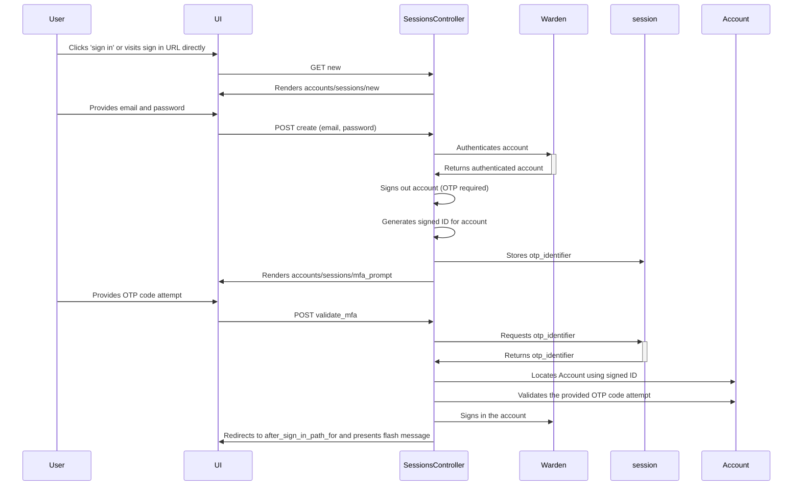

# Multi-factor authentication

This application uses MFA to help to protect access to accounts. At the moment,
the only supported MFA mechanism is time-based one-time-passwords (TOTP). In the
future, this may expand to other mechanisms, or (more likely), we will integrate
with organisations' own authentication platforms that will implement their own
MFA.

Supported MFA functions are:

1. Sign in without MFA if it is not enabled
2. Require MFA with sign in if it is enabled
3. Configure a single device with TOTP to use for sign in (multiple devices are
   not supported right not)
4. Generate 5 backup codes that can be used instead of/in place of device-based
   TOTP.
5. Reset backup codes to invalidate lost or consumed codes.

Once enabled, MFA can be switched to another device, but cannot be disabled. MFA
is required to use the app, but this may change based on user feedback.

### How sign-in MFA works

The library we are using `devise-two-factor-authentication` provides a custom
strategy called `:two_factor_authenticatable` that expects the OTP code attempt
to be provided along with the authentication keys (email) and password of the
user. Unfortunately, this is incompatible with our user workflow, which requests
the email and password of the user, and then the MFA code if it is required.

To support this flow, we have split the authentication into two steps:

#### Step 1: Authentication

- The user is presented with a form allowing them to provide their email and
  password (Devise-stock `accounts/sessions#new`).
- The user enters an email and password, which is validated by the standard
  Devise `:database_authenticatable` strategy. This strategy also runs any
  pre-screens on the user to check that they can sign in the first place (for
  example, if they are locked, unconfirmed or inactive, they cannot sign in).
- If the user has provided an invalid email or password, Warden's failure mode
  activates, redirecting back to the sign in page with a flash error message.
- If the user has provided a valid email and password, but has not yet activated
  MFA, they are signed in. Additional checks within the application require them
  to have MFA enabled to do anything.
- If the user has provided a valid email and password, and have activated MFA,
  `accounts/sessions#create` signs the account out (`warden.authenticate!` has
  signed the account in), and generates a
  [signed global ID](https://github.com/rails/globalid) representing the
  account, and stores it in the session. The controller also renders the OTP
  validation form.

#### Step 2: OTP validation

- The controller has presented a form to the user after they have entered their
  valid email and password. This form requests their OTP code (labelled
  "Two-factor authentication code") as a single text field.
- The user enters an OTP code, either from their device, or using one of their
  backup codes, and submits the form.
- The signed ID of the account is retrieved from the session and resolved to the
  account, so long as it has not been tampered with or expired.
- The resolved account validates and consumes the OTP code provided by the user
  via form params.
- If the account was resolved, and the OTP code is reported to be valid, we
  follow the same steps we follow when a user signs in without MFA - we sign
  them in, set a flash message, and redirect to the stored after sign in path.
- If the account was not resolved, or if the OTP code was invalid, we react as
  if the entire authentication attempt failed, redirecting back to the initial
  sign in page with a flash error message.

#### Failure modes:

- Invalid email (account not found)
- Locked account
- Unconfirmed account
- Inactive account
- Invalid OTP token
- Expired signed ID for account
- Tampered or reused signed ID for account

In all these failure modes, the application returns the user to the sign in page
with a generic failure message (in paranoid mode).

This sequence description is represented by the following sequence diagram:

