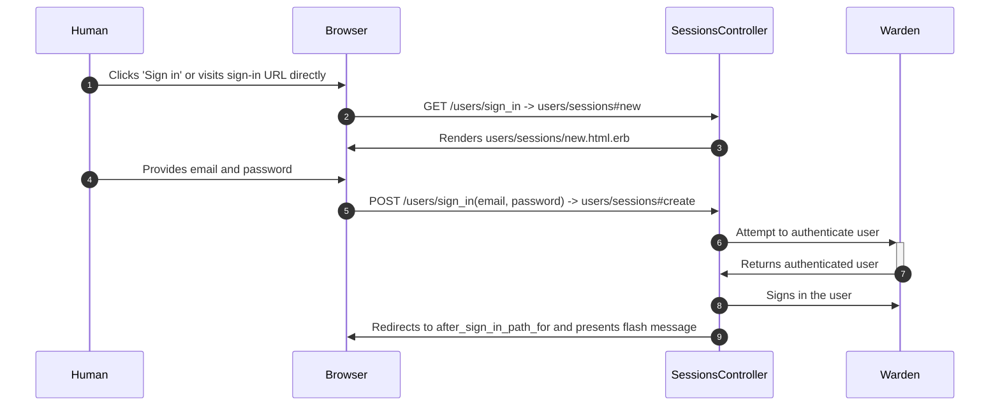
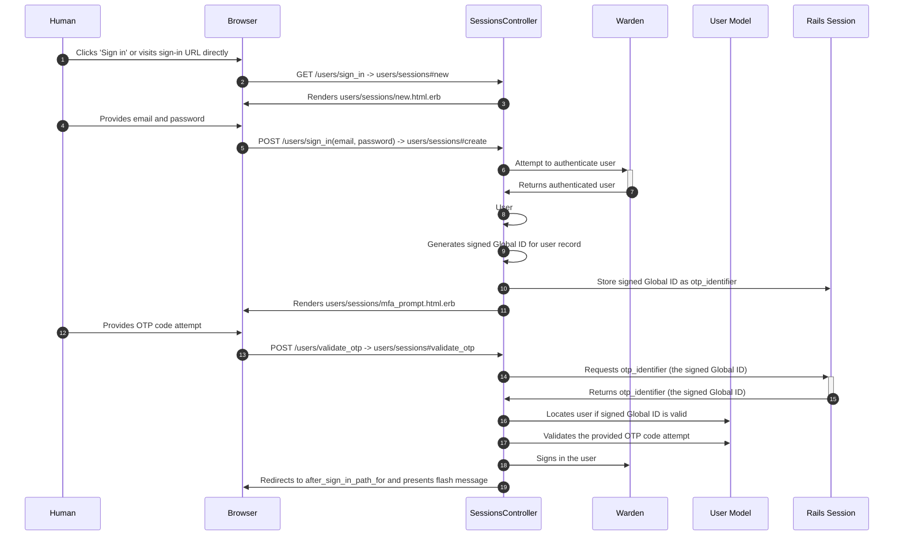

# Multi-factor authentication

This application uses MFA to help to protect access to accounts. The only
currently supported MFA mechanism is time-based one-time-passwords (TOTP).

Supported MFA functions are:

* Sign in without MFA if it is not enabled
* Require MFA with sign in if it is enabled
* Configure a single device with a TOTP code to use for sign in. Multiple
* devices are not supported right not.
* Generate 5 backup codes that can be used instead of/in place of device-based TOTP.
* Reset backup codes to invalidate lost or consumed codes.

Once enabled, MFA can be switched to another device, but cannot be disabled.

## How sign-in MFA works

The library we are using
[devise-two-factor-authentication](https://github.com/devise-two-factor/devise-two-factor)
provides a custom strategy called `:two_factor_authenticatable` that expects the
OTP code attempt to be provided at the same time as email and password.

This works fine if MFA is **required** for **all** users. We can add MFA to more
applications if we default to MFA being an opt-in security upgrade for users so
opt-in MFA is our default configuration.

The `otp_required_for_login` attribute on `User` (accessible through
`User#otp_required_for_login?`) decides whether a user **must** use MFA to sign
in. If the application needs to force some categories of users to use MFA (e.g.
admins) then this flag should be set on those users during sign-up and all
functionality allowing users to unset the flag should be removed from the app.

To support our default "MFA as opt-in security upgrade" flow, we have split the
authentication into two steps:

## Can I force some/all users to use MFA?

Yes. There is a commented out code in [ApplicationController](../app/controllers/application_controller.rb) that demonstrates how to require MFA for some or all users.

### Step 1: Authentication

- The user is presented with a form allowing them to provide their email and
  password (Devise's stock `accounts/sessions#new`).
- The user enters an email and password, which is validated by the standard
  Devise `:database_authenticatable` strategy. This strategy also runs any
  pre-screens on the user to check that they can sign in the first place (for
  example, if they are locked, unconfirmed or inactive, they cannot sign in).
- If the user has provided an invalid email or password, Warden's failure mode
  activates, redirecting back to the sign in page with a flash error message.
- If the user has provided a valid email and password, but their account does
  not **require** MFA (`#User.otp_required_for_login?` returns false) then they
  are signed in. Additional checks within the application forcibly redirect all
  signed-in routes to the "enable MFA" screen if MFA is required
- If the user has provided a valid email and password, and have activated MFA,
  `accounts/sessions#create` signs the account out (`warden.authenticate!` has
  signed the account in), and generates a
  [**signed** Global ID](https://github.com/rails/globalid) representing the
  account, and stores it in the session. `accounts/sessions#create` then renders
  the OTP validation form to being step 2.

### Step 2: OTP validation

- The OTP validation form requests their OTP code (labelled "Two-factor
  authentication code") as a single text field.
- The user enters an OTP code, either from their device, or using one of their
  backup codes, and submits the form.
- The signed Global ID of the account is retrieved from the session and resolved to the
  account, so long as it has not been tampered with or expired.
- The resolved account validates and consumes the OTP code provided by the user
  via form params.
- If the account was resolved, and the OTP code is reported to be valid, we
  follow the same steps we follow when a user signs in without MFA - we sign
  them in, set a flash message, and redirect to the stored after sign in path.
- If the account was not resolved, or if the OTP code was invalid, we react as
  if the entire authentication attempt failed, redirecting back to the initial
  sign in page with a flash error message.

### Failure modes:

- Invalid email (account not found)
- Locked account
- Unconfirmed account
- Inactive account
- Invalid OTP token
- Expired signed ID for account
- Tampered or reused signed ID for account

In all these failure modes, the application returns the user to the sign in page
with a generic failure message (in paranoid mode).

### Example flows

#### Sign in a user who does not have MFA enabled

This flow applies to users whose `otp_required_for_login` is `false`. This is the default devise sign-in flow.

#### Sign in a user who has MFA enabled

This flow applies to users whose `otp_required_for_login` is `true`.

